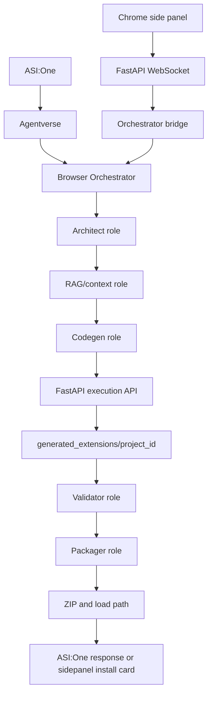
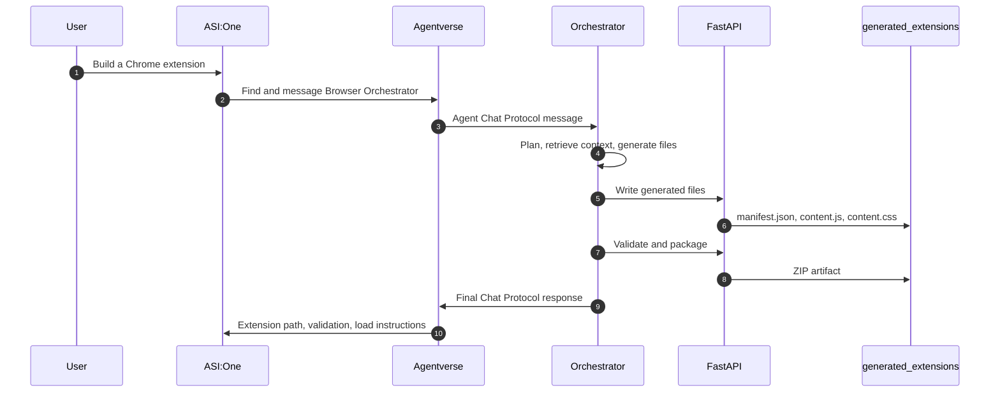
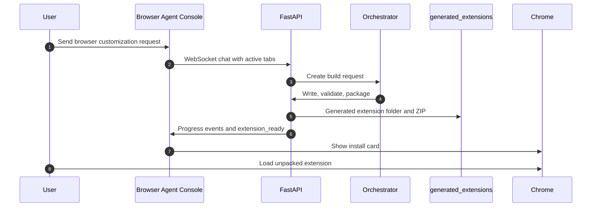
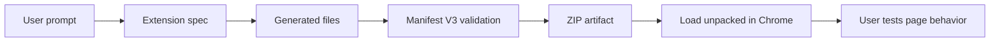

# Browser Forge architecture

Browser Forge has three moving parts:

- ASI:One and Agentverse for discovery and public chat.
- A FastAPI backend for execution work that needs local filesystem and browser access.
- A Chrome side panel for browser context, install cards, and hands-on testing.

The main product promise is concrete: the system creates a real Chrome extension folder, validates it, packages it, and tells the user how to load it.

## System map



ASI:One is where a user can discover and talk to the registered Orchestrator. Agentverse hosts the agent profile and routes Chat Protocol messages to the public `/submit` endpoint exposed by the local uAgents process.

## Request flow from ASI:One



The Orchestrator is the public agent. It calls local specialist roles in code today. Those roles are split into separate modules so they can also be registered as their own Agentverse agents when you want more discovery pages.

## Request flow from the Chrome side panel



The side panel does not own Agentverse credentials. It sends browser context to the backend. The backend decides how to route the request and returns the same progress events the UI already understands.

## Agent roles

The uAgents code lives in `backend/agentverse_app/`.

- `main.py`: starts the uAgents Bureau and publishes the Chat Protocol manifest.
- `orchestrator.py`: runs the build flow and formats the final response.
- `architect.py`: turns the prompt into a Chrome extension spec.
- `rag.py`: supplies curated extension patterns and can later wrap graph search.
- `codegen.py`: creates `manifest.json`, `content.js`, and `content.css`.
- `validator.py`: calls the backend validator.
- `packager.py`: creates a ZIP and load instructions.
- `backend_client.py`: HTTP client for the internal FastAPI execution API.
- `register.py`: helper for Agentverse registration.

The registered Orchestrator is enough for an end-to-end demo. Registering the specialist roles separately improves the Agentverse submission because each role gets its own searchable profile.

## Backend responsibilities

The backend is deliberately boring. That is the point. Agentverse decides what should happen; FastAPI performs the local work.

Internal execution routes:

```text
POST /internal/agentverse/projects
POST /internal/agentverse/projects/{project_id}/files
GET  /internal/agentverse/projects/{project_id}/files
POST /internal/agentverse/projects/{project_id}/validate
POST /internal/agentverse/projects/{project_id}/package
POST /internal/agentverse/projects/{project_id}/load-info
```

These routes are protected with `AGENTVERSE_EXECUTION_TOKEN` in demo mode. They write to `backend/generated_extensions`.

## Generated extension lifecycle



Validation checks manifest shape, referenced files, JavaScript syntax, and obvious Manifest V3 compatibility issues. It does not prove that a selector matches the live website. The side panel provides browser context and console capture so the project can move toward real runtime verification.

## Main directories

```text
backend/
  agentverse_app/           Agentverse and uAgents code
  utils/                    model config, validation, browser tools, execution helpers
  generated_extensions/     generated extension folders and ZIP artifacts

browser-agent-console/
  src/sidepanel/            Chrome side panel app
  src/content/              page context and highlighter scripts
  src/background.ts         extension service worker
```

`backend/generated_extensions` is ignored by git. It is local runtime output.

## Runtime ports

```text
8000  FastAPI backend
8001  uAgents Chat Protocol endpoint
4040  ngrok local inspector
```

Agentverse should receive the public ngrok URL for port `8001`, ending in `/submit`.

## Why ASI:One matters

ASI:One is the user-facing discovery and chat surface. A user can search for a browser customization agent, open the Browser Orchestrator, and ask for a real extension. Agentverse provides the agent profile, Chat Protocol routing, and discovery metadata. The local backend remains the executor because browser extension generation needs local files, validation, and Chrome load instructions.
