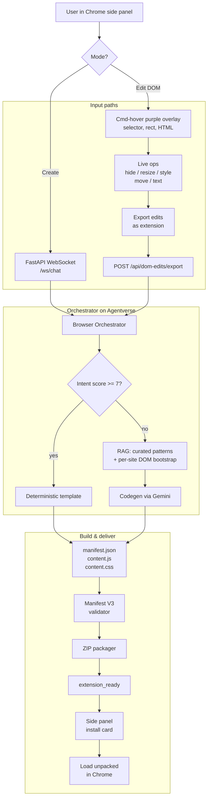

# Browser Forge — Devpost submission

## Inspiration

The web you see every morning is not really yours. YouTube decides Shorts belong on your homepage. Gmail decides which rail of icons you can collapse. Twitter (sorry, X) keeps "For You" pinned in front of "Following." Every site has a thousand tiny opinions about how you should spend your attention, and none of them ask first.

If you actually want a different version of the internet, the bar is high. You learn Manifest V3, you fight with content scripts, you write a CSS selector, you reload the unpacked extension, you find out it broke when YouTube renamed a class name. Most people don't have an afternoon for that. They just want the comments gone.

We kept watching friends complain about the same five things on the same three websites and never doing anything about them. That gap, between "I wish this site worked differently" and "I have a working Chrome extension installed," is what we wanted to delete.

## What it does

*Browser Forge* is a Chrome side panel that turns one sentence into a real, installable Chrome extension. You type what you want, the agent plans it, writes it, validates the manifest, packages a ZIP, and hands you a Load Unpacked card. End to end, from prompt to installed extension, takes under a minute.

A few things people have actually asked it for:

- "Hide YouTube comments and Shorts on the homepage."
- "Make Gmail's left sidebar wider and pin the Snoozed folder."
- "Remove the Stories row from Instagram web."
- "Block recommended posts on LinkedIn but keep the feed."
- "Add a button on every Notion page that copies the URL."

Two modes live in the same panel:

**Create mode** is the one above. You describe a behavior, and the agent generates a fresh Chrome extension folder with `manifest.json`, `content.js`, and `content.css`. It validates against Manifest V3, zips it, and shows you exactly where to click in `chrome://extensions`.

**Edit DOM mode** is the one we got obsessed with at 4am. Hold Command, hover, and a soft purple outline traces every element on the page. Click to select. The selected element becomes a chip in the chat, and now you can say "make this 30% wider," "hide it," "move it to the top," "change the text to 'inbox zero'," and watch it happen live on the page. Select five elements in order and ask "remove the third one and make the second one bold." The agent understands the chronology. When you've stitched together a set of edits you actually like, a button slides in: **Export edits as extension**. One click and your live experiment becomes a permanent, installable extension that re-applies those exact changes every time you open the site.

You can think of it as a personal browser stylist that also happens to ship Chrome extensions.

## How we built it

Three things power *Browser Forge*: ASI:One and Agentverse on the discovery side, a FastAPI backend doing the dirty filesystem work, and a Chrome side panel that knows about your tabs.

We registered exactly one agent on Agentverse, the **Browser Orchestrator**, and gave it five internal roles instead of five separate registrations. The Orchestrator is the only public surface. Inside it, we have an Architect (turns the prompt into a Chrome extension spec), a RAG role (curated patterns, plus a per-site DOM bootstrap so the model knows what `ytd-comments` looks like before it tries to hide it), a Codegen role, a Validator, and a Packager. They call each other in code today, but they're split into separate modules so we can register them as their own Agentverse agents whenever we want more discovery pages.

A novel-prompt detection layer lives on top of all of that. If your request scores high against our intent corpus (think: "hide YouTube comments"), we hand it to a deterministic template and you get a known-good extension in a few hundred milliseconds. If the score is low, we fall through to the LLM with the relevant site bootstrap injected into the RAG snippets. This was the difference between an agent that handles the demo and an agent that handles whatever the judges throw at it.

Here's the full flow, from prompt to installed extension:

The Edit DOM mode was the trickiest piece. The content script tracks selection order, captures the original style of every element you touch (so we can revert cleanly when you switch pages), and translates phrases like "make the second one a bit wider" into a normalized op set: `hide`, `resize`, `style`, `move`, `emphasize`, `text`. When you hit Export, we replay that history server-side, render the same operations as a static `content.js` and `content.css`, and run the result through the same validator and packager the Create flow uses. So an Edit DOM session and a Create-mode prompt produce the exact same kind of artifact at the end.

The side panel itself is a React app with two themes (purple for Create, a darker blue for Edit DOM) that swap via root CSS variables, so switching modes feels like flipping a switch instead of reloading a page.

## Track: Flicker to Flow

This is the friction we set out to delete. Every flicker of "ugh, why is this here" on a site you visit ten times a day is a tiny tax on your focus. *Browser Forge* turns each of those flickers into one sentence and one click, and then the friction is just gone, permanently, every time you open that site. The annoyances most people learn to tune out (Shorts, suggested posts, that one sticky banner) become things you actually fix in the thirty seconds you have between meetings. That's the flow we want to give back.

## Challenges we ran into

The deterministic-vs-LLM tension nearly broke us twice. Early on, the LLM would happily write a YouTube extension that targeted classes that haven't existed since 2022. We swung the other way and over-templated, which made novel prompts feel like the agent was ignoring you. The intent-scoring threshold (we landed on 7) and the per-site DOM bootstrap snippets in RAG were what finally got both axes working at once.

WebSockets were the second pain point. The side panel's `useEffect` was only re-initializing on project changes, so a single dropped connection would leave the user staring at "Not connected to server yet" forever. We rewrote it around a `wsConnectEpoch` counter and a `scheduleReconnect` that survives flaky tunnels and laptop sleeps.

Edit DOM mode forced us to think hard about scope. The first version cheerfully kept your selections from CNN active when you tabbed over to Gmail, which produced some very confusing edit chips. We now key the selection store on `(tabId, exact URL)` and clear everything on page change in DOM mode, while leaving Create mode untouched.

And then the dumb-but-real one: the FastAPI process was running an old build for an entire afternoon, returning 404 on the brand new `/api/dom-edits/export` route while we second-guessed our own code. Restarting the server is, somehow, still the answer.

## Accomplishments that we're proud of

- One Agentverse registration, five internal roles, end-to-end real artifacts. No mocked outputs.
- Edit DOM to extension export. As far as we know, nothing else lets you live-edit a page and walk away with a permanent Chrome extension that re-applies your changes.
- Sub-minute path from "I want this gone" to a ZIP loaded in `chrome://extensions`.
- The hybrid deterministic/LLM router. It's the difference between a demo and a thing you'd actually keep installed.

## What we learned

Browser extensions are mostly UX, not code. The hard part of "hide YouTube comments" isn't writing the selector. It's making the user trust that the thing they just installed actually does what they asked. Validating the manifest, showing the load instructions inline, and letting people preview DOM edits live before committing them did more for trust than any model upgrade.

We also learned that one well-built agent beats five half-built ones for a hackathon. We kept being tempted to register the Architect, RAG, Codegen, Validator, and Packager as their own Agentverse profiles, but every time we tried, the demo got worse. Concentrate the brain, distribute the work in code.

## What's next for the extension

A few things we want before this stops being a hackathon project:

A real runtime verifier. We validate Manifest V3 statically, but we don't yet prove that a selector matches the live page. The side panel already captures DOM snapshots, so the next step is feeding those back into the validator and self-correcting when a class name has changed.

Cross-device sync for your generated extensions, so the YouTube fix you wrote on your laptop shows up on your work machine without touching `chrome://extensions` again.

A community gallery. Half the prompts people typed at us were variations of the same five frustrations, and we'd rather they install someone else's clean version than ask the agent to rewrite it for the hundredth time.

And eventually, a Firefox build. We tried to keep the codegen layer browser-agnostic, but the Manifest V3 differences are real and we haven't done the work yet.
