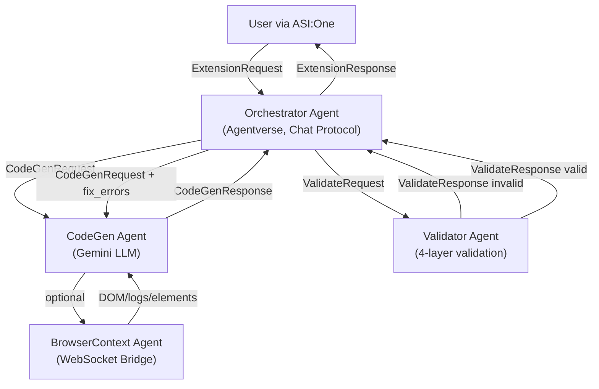
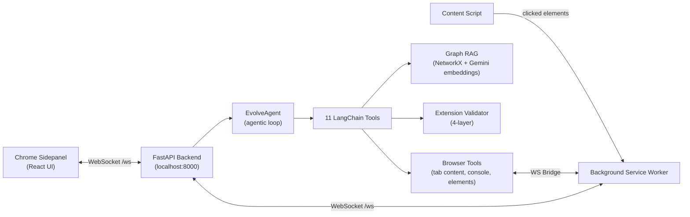
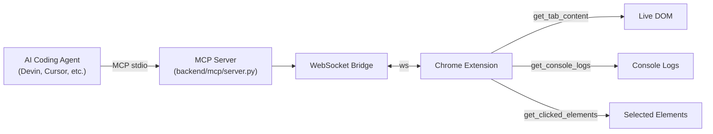

# System Architecture

## Multi-Agent Data Flow (Fetch.ai Track)

## Browser ↔ Backend Pipeline (Cognition Track)

## MCP Server Integration

## Tech Stack

| Layer | Technology |
|---|---|
| Frontend | Chrome Extension (React + TypeScript + Vite + CRXJS) |
| Backend | Python (FastAPI + WebSocket) |
| Agents | Fetch.ai uAgents SDK (Agentverse) |
| LLM | Google Gemini (`gemini-2.5-flash`) |
| Search | Graph RAG (NetworkX + `text-embedding-004`) |
| Plugins | MCP server (stdio transport) |
| Database | SQLite (aiosqlite) |
